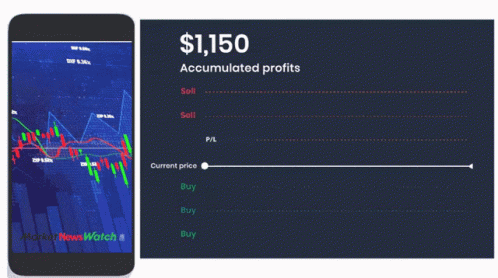

# Stocklerts: 
<h2 align="center"> Stock Trading updates that move as Fast as Your Ambitions</h2>

[Welcome to Stocklerts!](http://stocklerts.tech:5500/)
=================================


# Content
- [The Context](#the-context)
- [The Challenge of Staying Informed: A Costly Endeavor](#the-challenge-of-staying-informed-a-costly-endeavor)
- [Stocklerts: Empowering Investors, Simplifying Choices](#stocklerts-empowering-investors-simplifying-choices)
- [Real-Time Updates, Effortlessly Delivered](#real-time-updates-effortlessly-delivered)
- [Project Overview](#project-overview)
- [Tools and Technologies](#tools-and-technologies)
- [Get Involved](#get-involved)
- [How to Contribute](#how-to-contribute)
- [Author](#author)

## The context

Stock trading is the heartbeat of the global economy, where companies, investors, and traders engage in a dynamic dance that shapes 
the financial landscape. It's a world of constant flux, where market movements can impact fortunes and financial destinies in the blink
of an eye. For individuals navigating this intricate web, keeping abreast of stock developments is not merely a choice but a necessity.


### The Challenge of Staying Informed

For many individuals, especially those without dedicated financial advisors, staying informed about stocks can be both expensive and 
time-consuming. Monitoring a diverse portfolio of stocks demands constant attention to news, financial reports, and market trends. 
Subscribing to premium services or hiring financial experts can add significant costs, making comprehensive stock monitoring a luxury 
for some.

### Real-Time Updates, Effortlessly Delivered

__Stocklerts__ monitors stocks on your behalf. It eliminates the need for constant vigilance, allowing you to focus on your life while
still making informed investment decisions.
Imagine receiving alerts when significant news related to the stocks you follow breaks. __Stocklerts__ enables you to respond swiftly and 
make decisions that align with your financial goals. 

## Project Overview

__Stocklerts__ derives its name from the combination of 'stock trading' and 'news alerts.' As the name suggests, the core idea of the project
is to provide users with real-time stock price data and pertinent news, facilitating informed decision-making. 

The application is not a substitute for professional financial advice, stock market predictions, or comprehensive market analysis services. 
It does not provide buy/sell recommendations. However, it monitors stock prices, notifies users, and provides news articles not only about 
the stock they are following but also about the company to which it belongs. This feature can help users understand the factors leading to
changes in stock prices.




## Tools and Technologies 

**API Integration:**

To ensure that users receive timely and pertinent information for making informed trading decisions, the project integrates two APIs:
   - Alpha Vantage for market data
   - News API for relevant news updates.

**Front-end:**
- HTML
- CSS
- JavaScript
- Bootstrap

**Back-end:**
- Python
- Flask
- Nginx
- SQLAlchemy
- Cron

## Get Involved
__Stocklerts__ is an ongoing project, and I'm excited to continue refining and expanding its features.
If you have any feedback, suggestions, or would like to collaborate, feel free to reach out. Let's make __Stocklerts__ even better together!


### How to Contribute

1. **Fork the Repository:**
   Start by forking the __Stocklerts__ repository to your GitHub account. This creates a copy of the project under your GitHub profile.

2. **Clone the Repository:**
   Clone the forked repository to your local machine. Use the following command in your terminal:

   ```
   git clone https://github.com/your-username/Stocklerts.git

3. **Create a Branch:**
Before making any changes, create a new branch for your feature or bug fix:

  ```
  git checkout -b feature/your-feature-name
  ```
4. **Make Changes:**
Implement your changes or additions to the project. Ensure that your code follows the project's coding guidelines.

5. **Commit Changes:**
Commit your changes with clear and concise commit messages:
```
git add .
git commit -m "Add your meaningful commit message here"
```
6. **Push to Your Fork:**
Push your changes to your GitHub repository:
```
git push origin feature/your-feature-name
```
7. **Create a Pull Request:**
Open a pull request (PR) on the original __Stocklerts__ repository. Provide a detailed description of your changes and any relevant information.

Feel free to reach out if you have any questions. Let's collaborate and enhance __Stocklerts__ together!


## Author
Nora BEN HADDOU - [Github](https://github.com/Nawaritta) / [Twitter](https://twitter.com/NoraBH7)

